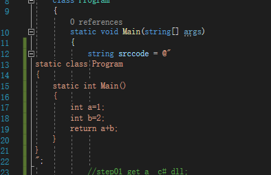
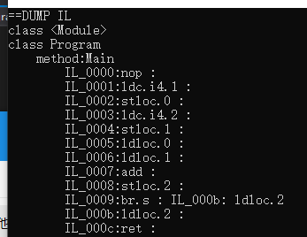
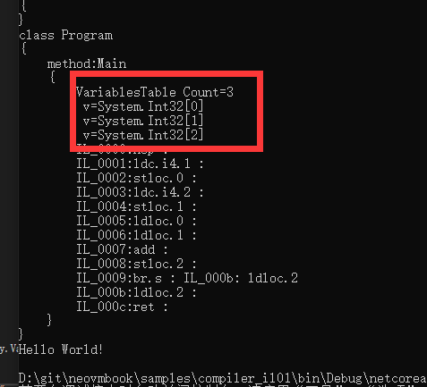
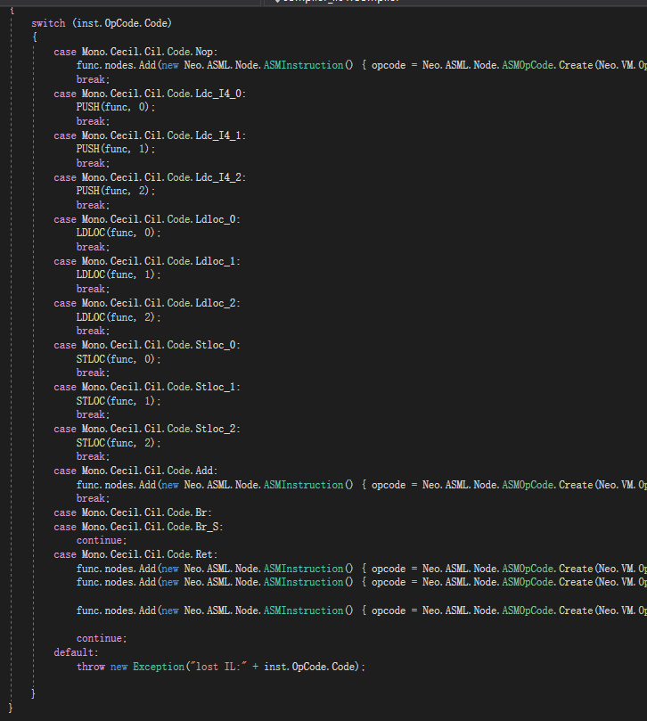

Reference source code location  
https://github.com/lightszero/neovmbook/tree/master/samples/compiler_il01

# Compile AVM - Bytecode - Variables

Now let's talk about how to compile into AVM from another assembly language. In fact, there is no difference.

Let's take IL as an example. As a stack virtual machine, IL and AVM have many similarities.

Unlike AVM, IL still retains the modular structure of the function level. IL does not connect to a large byte[], but each function corresponds to a byte[]. The call of IL is still a function level, and each function corresponds to The IL instruction address starts from zero, and the IL jmp has been converted to the address.



Let us still use this 1+2 example.

We compiled the above srccode into a c# dll, compiled in DEBUG mode, and its IL code should look like this.



Well, let’s talk about it one by one.

nop - Do noting

ldc - Is the PUSH of NEOVM

stloc - Put the values into the variable table.

ldloc - Take the values from the variable table.

add - Is the ADD of NEOVM

br - Is the JMP of NEOVM

ret - Is the RET of NEOVM

This br instruction is compiled by DEBUG mode. It will be optimized when compiled in RELEASE mode. Many other optimization instructions will be generated by using RELEASE mode. For ease of explanation, let's skip this br first.

This br jump is a meaningless jump to the next instruction, ignoring it without any side effects.

Well, let's rearrange

```
PUSH 1
STLOC 0
PUSH 2
STLOC 1
LDLOC 0
LDLOC 1
ADD
STLOC 2
LDLOC 2
RET
```

Think about the pseudo code that appeared in the previous article.
```
    //int a=1
    PUSH 1
    STLOC 0
    //int b=2
    PUSH 2
    STLOC 1
    //return a+b
    LDLOC 0
    LDLOC 1
    ADD

    RET
```
Well, this is basically the same, isn't it?

The last STLOC 2 and LDLOC 2 are making a temporary variable that can be eliminated.

The compiler is probably doing this in DEBUG mode.
```
var c=a+b;
return c;
```

If you have already understood the previous article, you don't need to read the following content, because this next content is the second half of the previous article.

IL code directly applies the concept of variable table to variables. We discussed how to compile variables and add a variable table in the last article.

IL has this concept directly, so we translate his code directly. In addition, we need to count the number of temporary variables in the last article, but we don't need this time. IL has this data directly.



The variable table type and index of IL are both in.

The code is in samples/compiler_il01

Translation work becomes very simple. In most cases, if you have compiled a high-level language into AVM, and then you compile a high-level language bytecode into AVM, the second half of the work is similar.



Most of the code we just need to deal with it directly, the logic is the same as the previous compilation.

But there is a little trouble in STLOC,

The IL instruction is:
```
//IL CODE
LDC.i4.1
STLOC.0
```

But we expect the result of the translation to be:
```
//AVM
DUPFROMALTSTACK//array
PUSH 0//index
PUSH 1 // LDC.i4.1
SETITEM
```

The code of STLOC needs to package the code of LDC in the middle, maybe you consider to turn over the order, unfortunately, this will make the problem more complicated。

The meaning of STLOC is to take the value of the top of the CalcStack and put it into the variable table, instead of taking the previous instruction into it.

```
LDC.i4.1
LDC.i4.4
ADD
STLOC.0
```
For example, in this case, the calculation results of the above three instructions are put into the variable table, so it is impossible to change the code order, so how do we deal with it?

```
//AVM
PUSH 1 //LDC.i4.1
//STLOC.0 begin
DUPFROMALTSTACK//array
PUSH 0//index
PUSH 2
ROLL
SETITEM
//STLOC.0 end
```

We insert more instructions and let NEOVM adjust the order of the data on the stack.  

We use PUSH 2, ROLL two instructions to complete the parameter sequence flip on the stack.

For example, the value on the stack from bottom to top is [1，varArray，0/*varindex*/]

ROLL 2 can put the value of index 2 from the top of the stack to the top of the stack.

After executing ROLL 2, it is [varArray, 0, 1], which is what we expected.
