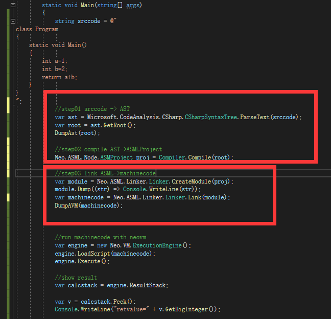
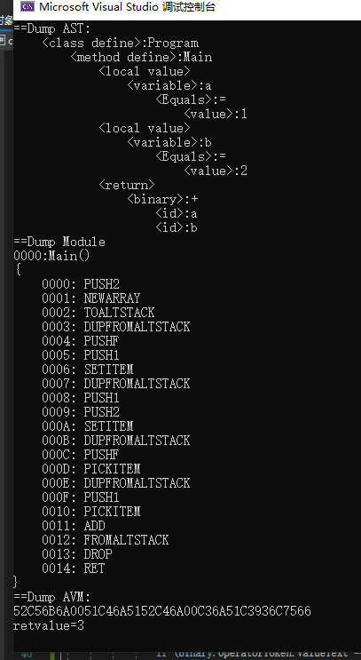

# AVM从何而来-高级语言-变量

之前我们已经讨论过地址转换了，那么这一篇就只是关于高级语言如何转换为AVM了

## 变量如何编译

第一个问题就是变量，高级语言里面我们对变量是习以为常的，而在NEOVM的指令序列里面，显然是没有变量的

```
int a=0;
```

那么这样一条高级语言指令，显然是无法被转换的

```
   int a=1;
   int b=2;
   return a + b;
```

我们要考虑一下在NEOVM 我们拥有什么，我们拥有一个计算栈 和 一个临时栈，
计算栈用来计算一个单纯的求职表达式比较容易，比如”1+2+3+4“，但是一旦出现了变量，好像就比较复杂了。


常量的计算用计算栈很容易表达
```
    const int a=0;
    const int b=2;
    return a+b;
    
    ==>

    PUSH 0
    PUSH 2
    ADD
    RET
```
变量之所以麻烦，在于变量可能会变化，所以变量应该来自于一个位置，而不是一个具体的值

比如，一个变量列表，我们用变量列表的思路再来看一下这段程序

假设我们有一个全局的变量列表
```
    //we have a List<int> values;
    int a=1; //a is values[0]
    //values[0] = 1;
    int b=2; //b is values[1]
    //values[1] = 2;
    return a + b;
    //return values[0]+values[1]
```

实际上，我们要编译这段代码，就需要创建一个变量列表
我们先设计两条伪代码，用来操作我们的变量列表
STLOC  把值放进变量表
LDLOC  从变量表取出值

用伪代码表示这段程序就是
```
    //int a=1
    PUSH 1
    STLOC 0
    //int b=2
    PUSH 2
    STLOC 1
    //return a+b
    LDLOC 0
    LDLOC 1
    ADD

    RET
```

然后我们把变量列表以代码的形式直接写出来
NEWARRAY
PICKITEM
SETITEM
这些操作NEOVM 都拥有了，我们在函数启动时在临时栈里创建一个变量列表，在函数RET时，拿掉这个变量列表，就可以了。

```
    //CreateArray size=2
    PUSH 2
    NEWARRAY
    TOALTSTACK

    //int a=1
    DUPFROMALTSTACK //getarray
    PUSH 0//index
    PUSH 1//value
    SETITEM

    //int b=2
    DUPFROMALTSTACK //getarray
    PUSH 1//index
    PUSH 2//value
    SETITEM

    //get value a
    DUPFROMALTSTACK //getarray
    PUSH 0//index
    PICKITEM

    //get value b
    DUPFROMALTSTACK //getarray
    PUSH 1//index
    PICKITEM

    //add
    ADD

    //return
    //cleararray
    FROMALTSTACK 
    DROP
    RET
```

你可以在samples/compiler_csharp01下找到這個程序




他的代码分为明显的几个部分
step01 是解释c#源代码为抽象语法树（AST)，这里我们可以直接调用rosyln来解决，无论你打算编译什么高级语言，基本上把他解释为AST这一步都有很多现成的东西可以使用

step02 是将AST变成汇编的部分
这一部分是编译器主要的工作

step03 是连接器的工作，无论你要编译什么东西，从什么编译，这一部分总是一样的。
下一篇我们会讨论同样功能的代码从IL编译到AVM，那时你会发现 step03 仍然是一样的代码。

然后就是召唤NEOVM来测试了，毫无疑问，你会得到结果3。

```
class Program
{
    static void Main()
    {
        int a=1;
        int b=2;
        return a+b;
    }
}
//result 3
```

這是他的輸出



