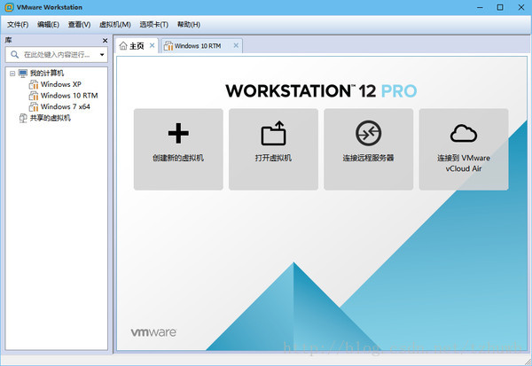
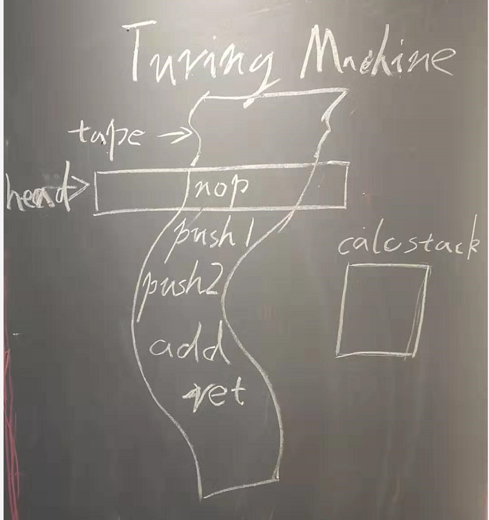
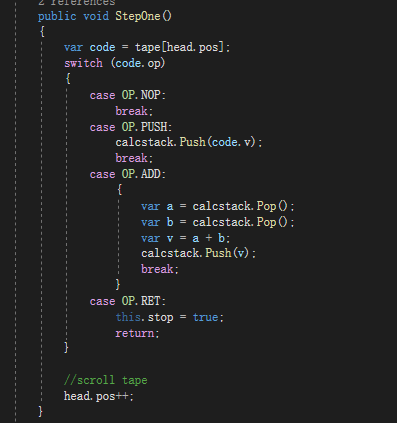

# NEOVM 是什么，以及他如何工作

NEOVM 就是 NEO's VM

拆开就很清楚了，Neo区块链系统中使用的虚拟机。

## 1.虚拟机的简单解释

虚拟机就是虚拟的电脑，现在我们通常提到的虚拟机有两种典型的形式

### 1.1一种是对一台电脑完整的模拟

比如hyper-V，VMWare



还有街机模拟器


### 1.2另一种是仅仅作为执行环境

比如JVM
比如dotnet framework
比如V8\lua

对于开发者来说，面对的执行环境又分为两大类情况

### 1.2.1 公用执行环境

公用执行环境，比如java c# python

### 1.2.2 一种是嵌入式执行环境

举个例子，比如lua 就是一种典型的嵌入式脚本。

当然也有通过mono 和 v8，把c# 和 js 作为嵌入式脚本使用的情况。

## 2 NeoVM是什么

NeoVM的形式就是上文 1.2.2 这种，和Lua相似，是一种嵌入式的执行环境

NeoVM是一种基于图灵机模式的虚拟机，通过磁头在磁带上的移动改变状态，以此来实现逻辑运算

NeoVM 是 不依赖于Neo项目的一个单独系统，NeoVM只提供纯粹的逻辑计算能力，采用可扩展的互操作方式，后插入虚拟机可以调用的功能。

NeoVM的设计更贴近机器，执行的代码段是一个内存块，执行时即时将数据解析为指令。

### 3 NeoVM的执行方式

要说明这件事情我们必须得复习一下图灵机了



忽略我丑陋的字迹

这里就假设你了解磁带式音乐播放器的工作原理，要不然head 和 tape 就变成一个晦涩的概念了。

1.在一条磁带tape上写上指令。

2.磁头head负责读取当前指令

3.指令集是已知的 图中展示了四条指令 

nop 啥也不做
push [n] 将一个数字推到calcstack 中
add 从calcstack中取两个值，将他们相加，再放回calcstack中
ret 结束当前执行

4.寄存器空间来管理状态，对NeoVM来说寄存器是两个Stack，CalcStack 和 AltStack

有磁带，有磁头，指令集，状态空间，这就是一个图灵机了。

### 4 talk is cheap

让我们来研究一下代码吧

代码在
samples/turing01

不到100行代码，模拟了那副丑陋的画里的图灵机执行过程


首先是准备好写着代码的磁带
```
NOP
PUSH 1
PUSH 2
ADD
RET
```
然后滚动磁带，让代码一条条滚到磁头下面

```
while(!vm.stop)
{
    ...
}
```
这里涉及到图灵机的停机问题，ret指令就是来通知停机的，要不然我们就会一直滚动下去。
当然也可以依赖纸带的长度来停机，实际上NEOVM是设计为纸带用完自动停机的
相信不会有人怀疑这个程序得到的retvalue是3。

让我们来分析一下发生了什么。


这只是模拟程序，一次说明一个问题，我们用class Head表示磁头，用List<OpCode>表示磁带

滚动磁带是通过head.pos的累加

状态空间 是 stop变量 和 calcstack 栈



执行指令的步骤写在函数StepOne中

stepone 的过程是 
1.读取磁带上位于磁头处的代码
2.执行代码
3.滚动磁头 head.pos++;

执行代码时就是操作状态空间

NOP 什么也不干，但NOP依然是最重要的指令之一，你就把他当作空格就好了。

RET 直接导致停机，磁头也不再滚动，
磁头位置也是状态空间的一部分，指令可以导致磁头位置变化，这一点很重要，因为流程控制的本质就是磁头位置变化，所有 的 if for while 逻辑，最后落实到vm上都是在改变磁头位置

PUSH 往calcstack上推一个值

ADD 从calcstack取两个值，相加后再放回去

如果你跑起这个程序，断点，一步步StepOne，观察calcstack，你会发现：

1.nop 之后，什么也没有发生
2.push 1 之后，calcstack里面是 [1]
3.push 2 之后，calcstack里面是 [2,1]
4.add 之后，calcstack 里面是 [3]
5.ret 之后,stop 变成true了，于是循环就结束了

这就是NEOVM的工作原理了。

对NEOVM来说 .avm 就是这条tape了，不同之处在于avm是byte[],不是像我们这里使用的List<Opcode> 这么结构化。

这篇的目的是解释NEOVM是什么，是怎么工作的，先用这个简单的程序进行说明。

更多问题，下一篇继续
