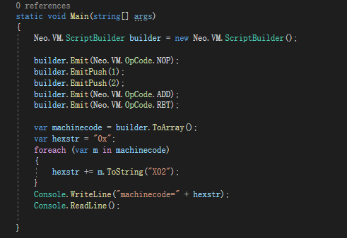

# NEOVM的.avm从何而来

## 汇编器
这里需要谈论一下汇编了

这涉及几个概念，汇编语言 机器语言 汇编器

有趣的是，你不需要专门为此去学习汇编

还记得上文的
```
NOP
PUSH 1
PUSH 2
ADD
RET
```
吗，就是这种东西，我们可以把它称为汇编语言了

而NEOVM输入的内容，就是NEOVM模拟的机器语言了，是byte[] 格式的

所以上文这五条指令，是可以被变成一段NEOVM认识的byte[]的机器语言的

完成这个过程的工具叫做汇编器。

我们来做个汇编器吧

NEOVM 中有一个 ScriptBuilder.cs 他完成了汇编器大部分的工作，除了链接。

除了链接，而链接这个问题就比较复杂了，也是汇编器的一个工作重点，这需要我们对NEOVM这类虚拟机有更多的链接才好继续探讨，让我们先把精力集中在将那五条汇编指令变成byte[]吧。

*NEO曾经有一个官方的汇编器项目（neoa，年久失修
https://github.com/neo-project/neo-compiler/tree/master/neoa
要研究编译器，汇编器也是必经之路，也许我会再维护一个新的汇编器项目）


直接上代码，这个程序位置在 samples/neovm01

注意引用的Neo3.0 的NeoVM，这系列文章都只针对NeoVM3.0，大可不必担心，其实NeoVM3.0并没有那么不同。


从nuget引入Neo.VM

然后用ScriptBuilder就能直接完成汇编器的工作，我们能得到
```
machinecode=0x6151529366
```

然后我们让neovm来执行这个


我们同样能得到retvalue=3

好了，到这里我们知道.avm 机器语言 是由汇编器从汇编语言汇编而来，虽然我们没谈链接，这个问题就比较复杂了，我们以后会专门讨论。

##汇编语言从何而来

那么问题来了，总不能手写汇编吧，这里就要引入一个 编译器 的概念了

我们需要一个工具将
```
"1+2"
```
翻译成
```
NOP
PUSH 1
PUSH 2
ADD
RET
```

这就是编译器的工作了

这样我们就得到了一个两步走工作

    1.编译器 高级语言=》汇编语言
    2.汇编器 高级语言=》机器语言

ok，我们接下来专注如何实现这个自动将加法运算编译为汇编语言的工作。


